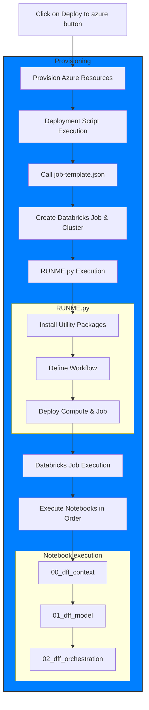

# Databricks fraud framework

The financial service industry (FSI) is rushing towards transformational change to support new channels and services, delivering transactional features and facilitating payments through new digital channels to remain competitive. Unfortunately, the speed and convenience that these capabilities afford is a benefit to consumers and fraudsters alike. Building a fraud framework often goes beyond just creating a highly accurate machine learning model due ever changing landscape and customer expectation. Oftentimes it involves a complex decision science setup which combines rules engine with a need for a robust and scalable machine learning platform. In this series of notebook, we'll be demonstrating how `Delta Lake`, `MLFlow` and a unified analytics platform can help organisations combat fraud more efficiently

---
+ <a href="$./01_dff_model">STAGE1</a>: Integrating rule based with ML
+ <a href="$./02_dff_orchestration">STAGE2</a>: Building a fraud detection model
---

+ <sri.ghattamaneni@databricks.com>
+ <nikhil.gupta@databricks.com>
+ <ricardo.portilla@databricks.com>

### Flow chart diagram
This flow chart details the execution order when deploying using the "Deploy to azure" button.

___

&copy; 2021 Databricks, Inc. All rights reserved. The source in this notebook is provided subject to the Databricks License [https://databricks.com/db-license-source].  All included or referenced third party libraries are subject to the licenses set forth below.

| library                                | description             | license    | source                                              |
|----------------------------------------|-------------------------|------------|-----------------------------------------------------|
| shap                                   | Model explainability    | MIT        | https://github.com/slundberg/shap                   |
| networkx                               | Graph toolkit           | BSD        | https://github.com/networkx                         |
| xgboost                                | Gradient Boosting lib.  | Apache2    | https://github.com/dmlc/xgboost                     |
| graphviz                               | Network visualization   | MIT        | https://github.com/xflr6/graphviz                   |
| pandasql                               | SQL syntax on pandas    | MIT        | https://github.com/yhat/pandasql/                   |
| pydot                                  | Network visualization   | MIT        | https://github.com/pydot/pydot                      |
| pygraphviz                             | Network visualization   | BSD        | https://pygraphviz.github.io/                       |