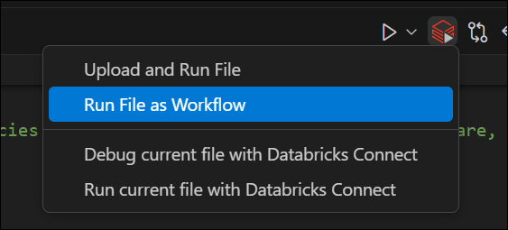
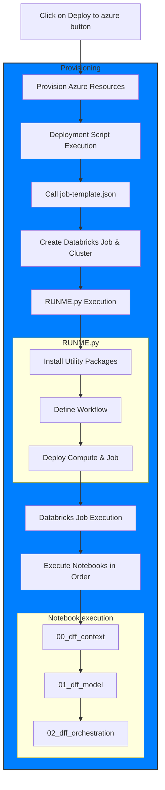

# Databricks fraud framework
The financial service industry (FSI) is rushing towards transformational change to support new channels and services, delivering transactional features and facilitating payments through new digital channels to remain competitive. Unfortunately, the speed and convenience that these capabilities afford is a benefit to consumers and fraudsters alike. Building a fraud framework often goes beyond just creating a highly accurate machine learning model due ever changing landscape and customer expectation. Oftentimes it involves a complex decision science setup which combines rules engine with a need for a robust and scalable machine learning platform. In this series of notebook, we'll be demonstrating how `Delta Lake`, `MLFlow` and a unified analytics platform can help organisations combat fraud more efficiently

---
+ <a href="$./01_dff_model">STAGE1</a>: Integrating rule based with ML
+ <a href="$./02_dff_orchestration">STAGE2</a>: Building a fraud detection model

---
+ <sri.ghattamaneni@databricks.com>
+ <nikhil.gupta@databricks.com>
+ <ricardo.portilla@databricks.com>

---
To run this accelerator, clone this repo into a Databricks workspace. Attach the RUNME notebook to any cluster running a DBR 11.0 or later runtime, and execute the notebook via Run-All. A multi-step-job describing the accelerator pipeline will be created, and the link will be provided. Execute the multi-step-job to see how the pipeline runs.

## Deploy to Azure

You can also deploy the accelerator to Azure and run all the notebooks by using the button below:

## How to run locally

1. Install the [Databricks](https://marketplace.visualstudio.com/items?itemName=databricks.databricks) extension to VS Code
1. Create an instance of Databricks Service in the Azure portal 
1. [Follow these steps](https://docs.databricks.com/en/dev-tools/vscode-ext/configure.html) to configure the extension with the new Databricks Service
1. Use the "Run file as workflow" button to run the notebook you want to test locally

## Notebooks summary

### 00 Context
This notebook provides an overview of Databricks' Fraud Framework solution. This serves as a starting point for configuring the environment before running analytical workflows.

### 01 Fraud Detection with XGBoost
The first notebook in this series focuses on building and deploying a fraud detection model using XGBoost, a powerful machine learning algorithm, and integrating it into a scalable MLflow-based pipeline. The notebook demonstrates how to preprocess data, train the model, evaluate its performance, and deploy it for real-time inference. It also highlights the importance of interpretability using tools like SHAP (SHapley Additive exPlanations) to explain the model's predictions.

#### Key Steps and Purpose  
1. **Data Preparation**

    Purpose: The notebook begins by loading raw transactional data from a CSV file and persisting it into a Delta Lake table for auditability and performance optimization.
    
    _Why It Matters_: Delta Lake ensures data reliability, scalability, and versioning, which are critical for fraud detection systems that handle large volumes of financial transactions.

1. **Feature Preprocessing**

    Purpose: Numeric features are standardized using a StandardScaler to ensure consistent scaling across training and testing datasets.

    _Why It Matters_: Proper preprocessing improves model accuracy and generalization, especially for algorithms like XGBoost that rely on numeric inputs.
     
1. **Model Training**

    Purpose: An XGBoost classifier  is trained to predict the likelihood of fraud (FRD_IND) based on transactional features such as:
    - _LAST_ADR_CHNG_DUR_: Duration since the last address change.
    - _AVG_DLY_AUTHZN_AMT_: Average daily authorization amount.
    - _DISTANCE_FROM_HOME_: Distance of the transaction from the customer's home.
    - _HOME_PHN_NUM_CHNG_DUR_: Duration since the last phone number change.
         
    _Why It Matters_: These features are carefully selected to capture patterns indicative of fraudulent behavior, such as unusual transaction amounts or recent account changes.

1. **Model Evaluation**

    Purpose: The model's performance is evaluated using metrics like AUC (Area Under the Curve)  and cross-validation scores.

    _Why It Matters_: AUC is a robust metric for binary classification problems like fraud detection, as it measures the model's ability to distinguish between fraudulent and legitimate transactions.

1. **Custom Pyfunc Wrapper**

    Purpose: The trained XGBoost model is wrapped in a custom Pyfunc model  (XGBWrapper) to include preprocessing logic and ensure seamless integration with MLflow.

    _Why It Matters_: This wrapper allows the model to be deployed in production environments where raw input data can be directly processed and scored without additional preprocessing steps.

1. **Model Deployment**

    Purpose: The trained model is logged to MLflow , registered in the model registry, and transitioned to the "Production" stage for real-time inference.

    _Why It Matters_: MLflow provides end-to-end model lifecycle management, enabling reproducibility, versioning, and deployment in scalable environments like Kubernetes.

1. **Model Interpretability**

    Purpose: SHAP values are computed to explain the model's predictions and identify the most important features contributing to fraud risk.

    _Why It Matters_: Interpretability is crucial for fraud detection, as it helps stakeholders understand why a transaction was flagged as fraudulent and builds trust in the system.

1. **Saving Results**

    Purpose: Fraud scores and SHAP values are saved to a Delta Lake table (silver_fraud_shap_values) for interactive querying and analysis.

    _Why It Matters_: Storing these results enables downstream applications, such as dashboards or case management systems, to analyze fraud patterns and improve decision-making.

### 02 Fraud Detection Framework Using Decision Graphs and MLflow
This script defines a fraud detection framework using decision graphs, MLflow for model orchestration, and SQL-based rule evaluation.

## Permissions requirements
The user need to have the following permissions for the deployment to succeed ([link](https://learn.microsoft.com/en-us/azure/databricks/getting-started/free-trial#permissions)):
- Azure Contributor or Owner role at the subscription level
- A custom role definition that has the following list of permissions:
  - Microsoft.Databricks/workspaces/*
  - Microsoft.Resources/subscriptions/resourceGroups/read
  - Microsoft.Resources/subscriptions/resourceGroups/write
  - Microsoft.Databricks/accessConnectors/*
  - Microsoft.Compute/register/action
  - Microsoft.ManagedIdentity/register/action
  - Microsoft.Storage/register/action
  - Microsoft.Network/register/action
  - Microsoft.Resources/deployments/validate/action
  - Microsoft.Resources/deployments/write
  - Microsoft.Resources/deployments/read

## Flow chart diagram
This flow chart details the execution order when deploying using the "Deploy to azure" button.

___

The job configuration is written in the RUNME notebook in json format. The cost associated with running the accelerator is the user's responsibility.

&copy; 2021 Databricks, Inc. All rights reserved. The source in this notebook is provided subject to the Databricks License [https://databricks.com/db-license-source].  All included or referenced third party libraries are subject to the licenses set forth below.

| library                                | description             | license    | source                                              |
|----------------------------------------|-------------------------|------------|-----------------------------------------------------|
| shap                                   | Model explainability    | MIT        | https://github.com/slundberg/shap                   |
| networkx                               | Graph toolkit           | BSD        | https://github.com/networkx                         |
| xgboost                                | Gradient Boosting lib.  | Apache2    | https://github.com/dmlc/xgboost                     |
| graphviz                               | Network visualization   | MIT        | https://github.com/xflr6/graphviz                   |
| pandasql                               | SQL syntax on pandas    | MIT        | https://github.com/yhat/pandasql/                   |
| pydot                                  | Network visualization   | MIT        | https://github.com/pydot/pydot                      |
| pygraphviz                             | Network visualization   | BSD        | https://pygraphviz.github.io/                       |